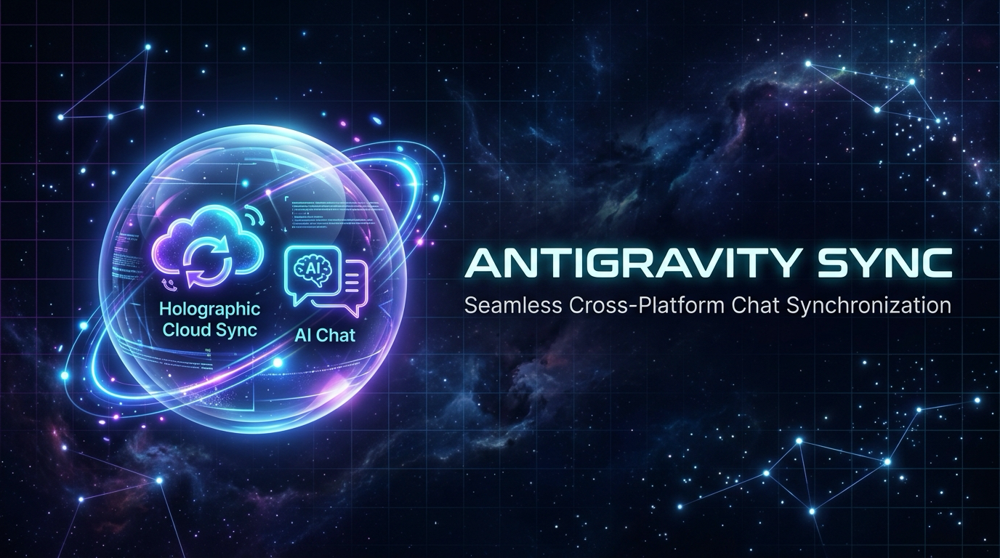

<div align="center">



# 🌌 Antigravity Sync
### *Float your AI chats across every machine. Zero config. Zero friction.*

[](https://github.com/zahidshaikh08/antigravity-auto-sync)
[](LICENSE)
[](README.md)
[](README.md)

<p align="center">
  A seamless, zero-configuration cloud synchronization and cross-platform migration suite for <b>Google Antigravity</b> (Antigravity IDE & Antigravity 2.0). 
</p>

</div>

---

## ✨ Features

- **100% Context & History Retention**: Exports turn-by-turn trajectory logs (`transcript.jsonl`), conversation SQLite databases (`.db`), message queues, media attachments, and generated artifacts.
- **Zero External Dependencies**: Built with 100% standard Python 3 (`sqlite3`, `zipfile`, `json`, `urllib`, `http.server`). No `pip install` required!
- **Cross-Platform Path Auto-Remapping**: Automatically translates absolute workspace URIs between macOS (`file:///Users/...`), Windows (`file:///C:/Users/...`), and Linux (`file:///home/...`).
- **SQLite WAL Checkpoint Integrity**: Safely flushes SQLite Write-Ahead Logs (`.db-wal`) before packaging to prevent missing messages or database locking errors.
- **Non-Destructive Safe Merging**: Importing into a machine that already has chats never overwrites or deletes local conversations. Automated timestamped backups are created before any merge.
- **Google Drive Cloud Auto-Sync**: Connect your personal Google Drive for continuous background sync with zero server costs and complete privacy.
- **Dual-Mode UX**:
  1. **Interactive Terminal Wizard**: Friendly numbered menu when run with no arguments (`python3 cli.py`).
  2. **Scriptable CLI**: Direct flags for power users and CI/CD (`export`, `import`, `sync`, `list`).
  3. **Antigravity Custom Skill**: Ask Antigravity directly in chat: *"Export my history to backup.zip"* or *"Sync my chats to Google Drive"*.
  4. **One-Click Launchers**: Double-clickable `.sh` and `.bat` scripts for non-technical users.

---

## 📁 Antigravity Storage Architecture

Antigravity stores conversation state across three distinct locations on your machine:

| Component | Path (macOS/Linux) | Path (Windows) | Description |
| :--- | :--- | :--- | :--- |
| **History Registry** | `~/.gemini/antigravity-history/cache.json` | `%USERPROFILE%\.gemini\antigravity-history\cache.json` | Master index read by the IDE sidebar. |
| **Conversation DBs** | `~/.gemini/antigravity-ide/conversations/*.db` | `%USERPROFILE%\.gemini\antigravity-ide\conversations\*.db` | SQLite databases containing message nodes and state. |
| **Brain Directories**| `~/.gemini/antigravity-ide/brain/<uuid>/` | `%USERPROFILE%\.gemini\antigravity-ide\brain\<uuid>\` | JSONL trajectories, tasks, media, and artifacts. |

---

## 🔌 Antigravity IDE Extension (Recommended - Zero CLI!)

Install the native Antigravity IDE extension to enjoy **100% silent, automatic cloud sync**:

### 1. Install Extension
Run in your terminal (or drag-and-drop the `.vsix` into Antigravity):
```bash
antigravity-ide --install-extension antigravity-history-sync-1.0.0.vsix
```
*(On macOS, the full path is `"/Applications/Antigravity IDE.app/Contents/Resources/app/bin/antigravity-ide"`)*

### 2. Connect Your Google Account
- Open Antigravity IDE.
- Look at the bottom-right status bar: **`☁ AGY Sync: Connect Drive`**.
- Click it (or press `Cmd+Shift+P` -> `Antigravity Sync: Connect Google Drive`).
- Sign in to your Google Account in the browser window and grant permission.

### 3. That's It!
- Whenever you chat on **Machine A**, Antigravity automatically detects the new messages and uploads them to Google Drive silently.
- Whenever you open Antigravity on **Machine B** (with the same Google Account), it pulls the new chats and merges them into your sidebar automatically!

---

## 🚀 Alternative Modes

### Mode 1: Portable ZIP Migration (Mac ↔ Windows)

#### Step 1: Export on Machine 1
Run the interactive wizard:
```bash
python3 cli.py
```
Or export directly via CLI:
```bash
python3 cli.py export -o ~/Desktop/antigravity-backup.zip
```

#### Step 2: Transfer Archive
Copy `antigravity-backup.zip` to your second computer via USB drive, AirDrop, or cloud drive.

#### Step 3: Import on Machine 2
On your second computer, run:
```bash
python3 cli.py import antigravity-backup.zip
```
The tool will:
1. Create a safety backup of any existing local chats.
2. Auto-remap workspace paths to match the target OS.
3. Merge the conversations safely.
4. **Reload Antigravity**—all your chats will be visible in the sidebar!

---

### Mode 2: Google Drive Cloud Auto-Sync

#### Step 1: Connect Google Drive
```bash
python3 cli.py login
```
Your default browser will open with standard Google OAuth. Click **Allow** (access is restricted strictly to the app's own folder).

#### Step 2: Sync Conversations
```bash
python3 cli.py sync
```
This uploads new local chats to your private `AntigravitySync` folder in Google Drive and downloads any updates made on your other machines.

#### Step 3: Run Background Watcher (Optional)
```bash
python3 cli.py daemon --interval 30
```
Runs a quiet background daemon that automatically syncs whenever local chats pause for 15 seconds.

---

## 🛠️ CLI Command Reference

| Command | Description | Example |
| :--- | :--- | :--- |
| `python3 cli.py` | Launches interactive menu wizard | `python3 cli.py` |
| `python3 cli.py list` | Lists all local conversations with step count and dates | `python3 cli.py list` |
| `python3 cli.py export` | Exports chats to a portable `.zip` | `python3 cli.py export -o backup.zip` |
| `python3 cli.py export --project` | Exports only chats matching a specific project | `python3 cli.py export --project "flutter_app"` |
| `python3 cli.py import` | Imports a backup `.zip` into Antigravity | `python3 cli.py import backup.zip` |
| `python3 cli.py import --conflict` | Sets conflict policy (`newer`, `overwrite`, `skip`) | `python3 cli.py import backup.zip --conflict newer` |
| `python3 cli.py login` | Connects personal Google Drive account | `python3 cli.py login` |
| `python3 cli.py sync` | Runs an immediate two-way Google Drive sync | `python3 cli.py sync` |
| `python3 cli.py daemon` | Runs continuous background sync daemon | `python3 cli.py daemon` |
| `python3 cli.py logout` | Disconnects Google Drive from local machine | `python3 cli.py logout` |

---

## 🤖 Antigravity In-Chat Integration (Skill)

The skill is installed in `~/.gemini/config/skills/agy-history-sync/`.

You can talk to the agent naturally in any conversation:
- *"Export all my chat history to ~/Desktop/my-backup.zip"*
- *"Import my past chats from /Users/zahid/Downloads/antigravity-backup.zip"*
- *"Check my local conversation statistics and database size"*
- *"Sync my chats with Google Drive"*

---

## 🧪 Running Tests

The test suite validates database checkpointing, cross-platform path remapping, and non-destructive merges in an isolated sandbox:

```bash
python3 tests/test_engine.py
```

---

## 🔒 Security & Privacy

- **Zero-Knowledge**: When syncing to Google Drive, data is stored in your personal Google Drive account. No third-party servers are involved.
- **Non-Destructive**: Every import automatically snapshots your current `cache.json` to `~/.gemini/antigravity-history/backups/` before any changes are made.
- **Restricted OAuth Scope**: Uses Google Drive's `drive.file` scope, meaning the tool cannot access, view, or touch any of your personal files or documents in Drive.
