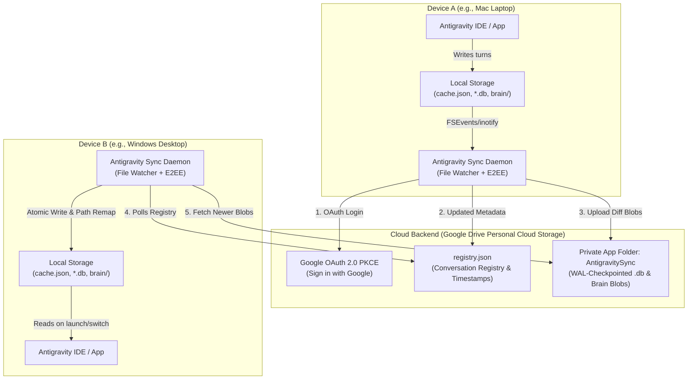

# Antigravity Cloud Auto-Sync: Architecture & Implementation Specification

## 1. Executive Summary & Feasibility

### Is it really possible?
**YES, 100% possible.** 
Antigravity stores its chat state completely locally in predictable filesystem locations (`~/.gemini/antigravity-history/` and `~/.gemini/antigravity-ide/`). A background sidecar daemon can watch these local files, atomically package conversation diffs, encrypt them, and sync them seamlessly with a cloud backend whenever changes occur, just like modern cloud-synced developer tools (e.g. VS Code Settings Sync, Obsidian Sync, or 1Password).

---

## 2. System Architecture



---

## 3. How It Works (Step-by-Step)

### A. One-Click Authentication (`agy-sync login`)
1. User types `python3 cli.py login` in terminal or requests it in Antigravity chat.
2. A lightweight local HTTP callback server starts on `127.0.0.1:49281`.
3. The default web browser opens to Google OAuth.
4. After authorization, the portal redirects to `http://localhost:49281/callback?code=...`.
5. The local client securely stores the OAuth tokens in `~/.gemini/config/gdrive_auth.json`.

### B. Background Watcher & Debounced Sync
1. The daemon watches `~/.gemini/antigravity-history/cache.json` and conversation databases.
2. When the user is actively chatting, Antigravity writes to `.db-wal` and `transcript.jsonl`.
3. The daemon uses a **15–30 second debounce timer**: it waits until the conversation pauses.
4. Once idle, the daemon:
   - Performs a clean SQLite checkpoint (`PRAGMA wal_checkpoint(PASSIVE)`).
   - Packages changed conversations into `.agyzip`.
   - Uploads the payload to Google Drive `AntigravitySync/conversations/`.
   - Updates `registry.json`.

### C. Multi-Device Receiving & Atomic Application
1. When Device B runs `sync` or daemon is active:
2. It fetches `registry.json` and compares with local `cache.json`.
3. It downloads newer conversations.
4. Performs **Smart Auto-Remapping** on workspace paths:
   - Example: converts `file:///Users/zahidshaikh/...` (Mac) to `file:///C:/Users/zahid/...` (Windows).
5. Performs an atomic write to local `.db` and `brain/` folders.
6. Safely merges into `~/.gemini/antigravity-history/cache.json`.

---

## 4. Key Challenges, Onboarding & Edge Cases

### A. First-Run Onboarding (Existing Local Chats)
- **Interactive Initial Choice**:
  1. **Sync All Existing Chats**: Queues all past local chats for background upload.
  2. **Sync Only from Today Onward (New Chats Only)**: Leaves past chats strictly local; only syncs new chats.
  3. **Select Specific Projects/Chats**: Interactive picker to choose which workspaces or chats to upload.

### B. Second-Device Handshake (Cloud Chats + Local Chats)
- **Handshake Summary Screen**:
  ```text
  ┌────────────────────────────────────────────────────────────┐
  │  Antigravity Sync: Initial Handshake Detected             │
  │  • Cloud: 50 conversations found                           │
  │  • This PC: 15 local conversations found                   │
  │                                                            │
  │  [1] Merge Both Ways (Recommended - 65 total chats)       │
  │  [2] Download Cloud Chats Only (Keep 15 local chats local) │
  │  [3] Keep Separated (Only sync new chats from now on)      │
  └────────────────────────────────────────────────────────────┘
  ```
- Before executing the merge, an automated timestamped backup of the local state is saved to `~/.gemini/antigravity-history/backups/`.

### C. Selective Sync & Privacy Exclusions (Sensitive NDA Code)
- In-chat command `/sync-exclude` or adding `.agents/sync_exclude` marks any chat as **"Local-Only"**.
- Excluded chats are completely ignored by the sync daemon.

### D. Deletion Propagation & 30-Day Trash Bin
- Soft deletion with 30-day recovery in `~/.gemini/antigravity-history/trash/`.
