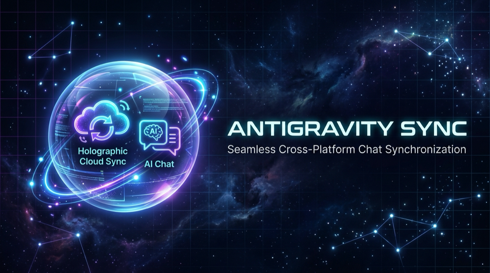

# 🌌 Antigravity Sync
### *Float your AI chats across every machine. Zero config. Zero friction.*

---

## ⚡ Why Antigravity Sync?

When switching between your work Mac, personal laptop, or desktop, you shouldn't have to lose your Antigravity conversation threads, code plans, thought chains, or agent state.

**Antigravity Sync** gives you seamless, background cloud synchronization across all your machines using your **personal Google Drive account**:

- ☁ **Zero Configuration**: Connect your Google Account once with 1 click.
- 🔄 **Real-Time Bidirectional Sync**: Automatically detects chat updates, debounces typing pauses, and synchronizes deltas silently.
- 🛡 **100% Private & Secure**: Backups are saved directly to your personal Google Drive (`AntigravitySync/`). No third-party servers, databases, or subscriptions.
- 🧭 **Cross-Platform Path Remapping**: Automatically maps workspace paths across macOS (`file:///Users/...`), Windows (`file:///C:/Users/...`), and Linux (`file:///home/...`).
- 🔒 **Safe-Merge Guarantee**: Non-destructive sync that never deletes or overwrites existing local conversations.

---

## 🚀 Quick Start

1. Install this extension in **Antigravity IDE** (or any VS Code-compatible editor).
2. Look at the bottom-right status bar: click **`☁ AGY Sync: Connect Drive`** *(or press `Cmd+Shift+P` -> `Antigravity Sync: Connect Google Drive`)*.
3. Sign in to your Google Account in the browser window and grant access.
4. **Done!** The status bar will switch to **`☁ AGY Sync: Active`**. Your conversations will now stay synchronized across all your devices automatically.

---

## 🎮 Status Bar Controls

Clicking the **`☁ AGY Sync`** status bar item opens a quick action menu:
- 🔄 **Sync Now**: Run an immediate two-way synchronization.
- ⏸️ **Pause / Resume Auto-Sync**: Toggle background watching on or off.
- 📊 **View Local Conversations & Stats**: Inspect indexed conversations and step counts.
- 📜 **View Sync Logs**: Monitor real-time background sync activity.
- 🚪 **Disconnect Google Drive**: Unlink your account from this machine.

---

## 🔒 Privacy & Open Source

- **Source Code**: [github.com/zahidshaikh08/antigravity-auto-sync](https://github.com/zahidshaikh08/antigravity-auto-sync)
- **License**: MIT
- **Privacy Guarantee**: We do not operate any middleman servers. All transfers occur directly between Antigravity and Google's official Drive APIs.
